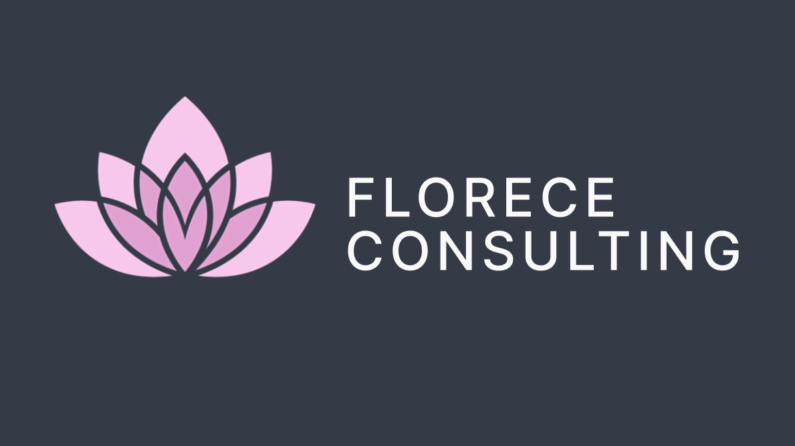

 

# Florece Consulting

This was built for a Communications professional seeking a sleek and simple website to showcase their skills and services to inform current clients and attract potiental clients.

For the CMS I used Sanity, as it offers a easy to use UI for those new to content management systems. 

[View Website](https://www.florececonsulting.com)

### Built Using
 &nbsp;&nbsp;
  &nbsp;&nbsp;
  &nbsp;&nbsp;
  &nbsp;&nbsp;
  &nbsp;&nbsp;
  &nbsp;&nbsp;
   &nbsp;&nbsp;
   &nbsp;
